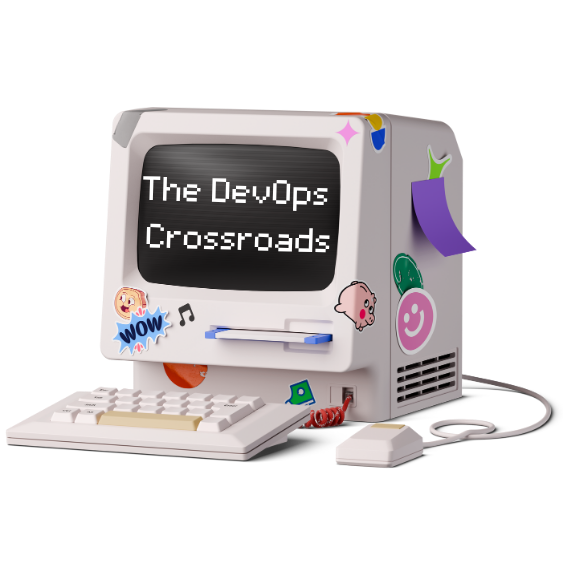

# The DevOps Crossroads

> Navigating the Convergence of DevOps, Security, and AI



[](https://www.linkedin.com/in/ambeka-deshmukh/)
[](https://medium.com/@thedevopscrossroads)
[](https://thedevopscrossroads.hashnode.dev)

## Welcome

Welcome to The DevOps Crossroads - where DevOps, Security, and AI converge. This repository documents my journey through the modern technology landscape, sharing insights, projects, and learnings along the way.

## 🏗️ Repository Structure

### 🚀 [DevOps & Platform Engineering](./devops/)
*Modern DevOps practices and platform engineering*
- [Weather Microservices](./devops/weather-microservices/) - Complete CI/CD pipeline with React, Node.js, Kubernetes, and ArgoCD
- CI/CD Pipeline Implementations
- Infrastructure Automation
- Monitoring & Observability
- GitOps Workflows

### ☁️ [Cloud Projects](./cloud-projects/)
*Serverless applications and cloud-native solutions with AWS , Azure and GCP*
- [URL Shortener](./cloud-projects/url-shortener/) - Serverless URL shortening service with DynamoDB and API Gateway
- [Trivia App](./cloud-projects/trivia-app/) - React-based trivia application with AWS Amplify
- AWS Disaster Recovery Solutions
- Serverless Email Marketing Platform

### 🔒 [Cloud Security](./cloud-security/)
*Cybersecurity implementations and automation*
- [AWS IAM Access Analyzer](./cloud-security/aws-iam-access-analyzer/) - Automated security monitoring with CloudWatch dashboards
- [S3 Bucket Security Analyzer](./cloud-security/s3-bucket-security-analyzer/) - Continuous S3 security monitoring with SNS alerts
- Security Automation Projects
- Compliance Monitoring

### 🏗️ [Infrastructure](./infrastructure/)
*Infrastructure as Code and Kubernetes*
- Terraform Modules
- Kubernetes Configurations
- CloudFormation Templates
- Network Automation

### 🤖 [AI & ML](./ai-ml/)
*Artificial Intelligence and Machine Learning*
- [Kendra Chat](./ai-ml/computer-vision/kendra-chat/) - AI-powered chat interface with Amazon Kendra
- [Resume Genie](./ai-ml/nlp-platforms/resume-genie/) - AI-powered resume optimization with AWS PartyRock
- GenAI Implementations
- ML for DevOps

### 📊 [Data Engineering](./data-engineering/)
*Data platforms and analytics solutions*
- Streaming Platforms
- Data Lakes & ETL Pipelines
- Snowflake Integrations
- Real-time Analytics

### 💻 [Code](./code/)
*Programming projects and automation scripts*
- Python Development
- Go Projects
- CLI Tools
- Reusable Libraries

### 📝 [Blog](./blog/)
*Technical articles and tutorials*
- [Introduction to DevOps](./blog/devops/introduction-to-devops.md) - Comprehensive guide to DevOps principles and implementation
- [Securing Your AWS Environment with IAM Access Analyzer](./blog/cloud-security/iam-access-analyzer.md) - Security best practices and implementation guide
- Cloud Security Guides
- AI/ML Tutorials

### 🎯 [Career Assets](./career-assets/)
*Professional development materials*
- Portfolio Summaries
- Technical Presentations
- Certifications
- Professional References

### 🎬 [Demonstrations](./demonstrations/)
*Live demos and interactive showcases*
- Live Environment Links
- Demo Scripts & Guides
- Video Walkthroughs

## 🌟 Featured Projects

### 🌤️ Weather Microservices
**Complete DevOps Implementation**
- **Tech Stack**: React TypeScript, Node.js, MongoDB, Docker, Kubernetes
- **DevOps**: GitHub Actions CI/CD, ArgoCD GitOps, Prometheus monitoring
- **Features**: Microservices architecture, container orchestration, automated testing
- [View Project →](./devops/weather-microservices/)

### 🔗 Serverless URL Shortener
**Cloud-Native Application**
- **Tech Stack**: React, AWS Lambda, DynamoDB, API Gateway, CloudFront
- **Features**: Serverless architecture, real-time analytics, custom domains
- **Infrastructure**: Infrastructure as Code with SAM/CloudFormation
- [View Project →](./cloud-projects/url-shortener/)

### 🔍 AWS IAM Access Analyzer
**Security Automation**
- **Services**: AWS IAM Access Analyzer, CloudWatch, Config, Lambda
- **Features**: Automated security monitoring, compliance dashboards, remediation
- **Architecture**: Event-driven security automation with SNS notifications
- [View Project →](./cloud-security/aws-iam-access-analyzer/)

### 🧠 Resume Genie
**AI-Powered Application**
- **Platform**: AWS PartyRock (Amazon Bedrock)
- **Features**: AI resume optimization, job description matching, content suggestions
- **AI Services**: Natural language processing for resume analysis
- [View Project →](./ai-ml/nlp-platforms/resume-genie/)

## 🛠️ Technology Stack

### Cloud & Infrastructure


### DevOps & CI/CD


### Programming


### Frontend & Data


## 🚀 Getting Started

### Prerequisites
- AWS Account with appropriate permissions
- Docker and Docker Compose
- kubectl and Kubernetes cluster access
- Node.js 18+ for frontend projects
- Python 3.9+ for backend services

### Quick Start
1. **Clone the repository**
   ```bash
   git clone https://github.com/your-username/the-devops-crossroads.git
   cd the-devops-crossroads
   ```

2. **Choose a project to explore**
   ```bash
   # DevOps - Weather Microservices
   cd devops/weather-microservices
   docker-compose -f docker-compose.dev.yml up
   
   # Cloud Security - IAM Access Analyzer
   cd cloud-security/aws-iam-access-analyzer/terraform
   terraform init && terraform apply
   
   # Cloud Projects - URL Shortener
   cd cloud-projects/url-shortener
   sam build && sam deploy
   ```

3. **Follow project-specific README instructions**

## 📈 Project Maturity Levels

### 🟢 Production Ready
- **AWS IAM Access Analyzer**: Full implementation with monitoring
- **S3 Bucket Security Analyzer**: Automated security scanning
- **Weather Microservices**: Complete CI/CD with Kubernetes

### 🟡 Development/Demo
- **URL Shortener**: Functional serverless application
- **Resume Genie**: AI-powered resume optimization
- **Trivia App**: React application with AWS Amplify

### 🔵 Proof of Concept
- **Kendra Chat**: AI chat interface demo
- **Data Engineering Projects**: Pipeline demonstrations

## 🎯 Learning Paths

### 🚀 DevOps Engineer Path
1. Start with [Introduction to DevOps](./blog/devops/introduction-to-devops.md)
2. Explore [Weather Microservices](./devops/weather-microservices/) for hands-on CI/CD
3. Learn GitOps with ArgoCD implementation
4. Implement monitoring with Prometheus and Grafana

### ☁️ Cloud Security Path
1. Begin with [AWS IAM Access Analyzer](./cloud-security/aws-iam-access-analyzer/)
2. Implement [S3 Security Scanning](./cloud-security/s3-bucket-security-analyzer/)
3. Read security blog posts for best practices
4. Build automated remediation workflows

### 🤖 AI/ML Integration Path
1. Explore [Resume Genie](./ai-ml/nlp-platforms/resume-genie/) for AI applications
2. Study [Kendra Chat](./ai-ml/computer-vision/kendra-chat/) for enterprise AI
3. Learn prompt engineering techniques
4. Implement AI in DevOps workflows

## 📊 Repository Statistics

- **Total Projects**: 10+ comprehensive implementations
- **Technologies**: 25+ tools and platforms
- **Cloud Services**: AWS, with multi-cloud patterns
- **Languages**: Python, TypeScript, Go, JavaScript
- **Infrastructure**: Kubernetes, Terraform, Docker
- **CI/CD**: GitHub Actions, ArgoCD, AWS CodePipeline


## 📞 Connect & Follow

### Professional Networks
- **LinkedIn**: [Connect for professional discussions](https://www.linkedin.com/in/ambeka-deshmukh/)
- **Medium**: [Follow for detailed technical articles](https://medium.com/@thedevopscrossroads)
- **Hashnode**: [Subscribe for latest posts](https://thedevopscrossroads.hashnode.dev)

### Learning Resources
- **GitHub**: Star and watch this repository for updates
- **Blog Posts**: Regular technical tutorials and guides
- **Live Demos**: Interactive showcases of key projects

## 🔮 Roadmap

### Q2 2025
- [ ] Advanced Kubernetes patterns and operators
- [ ] Multi-cloud deployment strategies
- [ ] Enhanced AI/ML integrations
- [ ] Advanced security automation

### Q3 2025
- [ ] Platform engineering showcase
- [ ] Service mesh implementations
- [ ] Advanced observability patterns
- [ ] Chaos engineering practices

### Q4 2025
- [ ] FinOps and cost optimization
- [ ] Advanced GitOps patterns
- [ ] Zero-trust security implementations
- [ ] Sustainable computing practices

---

<p align="center">
  <strong>Built with ❤️ at The DevOps Crossroads</strong><br>
  <em>Where DevOps, Security, and AI Converge</em>
</p>
