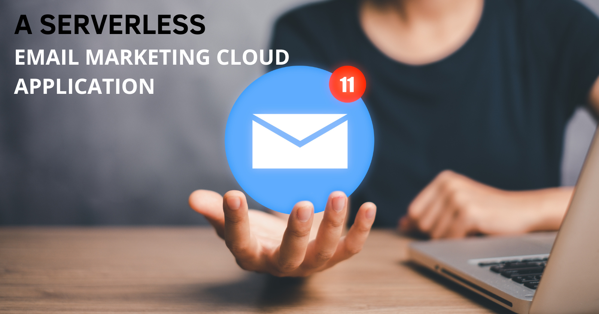

# Serverless Email Marketing Application



In this guide, we'll create a serverless email marketing application using various AWS services. The application will allow you to send bulk emails, track email events, and store email templates and tracking data.

## Services Used

- Amazon Simple Email Service (SES)
- Amazon EventBridge
- Amazon S3
- AWS Lambda
- AWS Identity and Access Management (IAM)

## Step-by-Step Instructions

### 1. Set up Amazon SES

1. Navigate to the [Amazon SES console](https://console.aws.amazon.com/ses/home).
2. Verify your domain and email addresses:
   - Click on **"Verified identities"** in the left sidebar.
   - Click **"Create identity"** and follow the prompts to verify your domain or email address.
3. If you're in the SES sandbox, request production access to send emails to any recipient. But for this project, we will use our sandbox environment for sending out our email.

### 2. Create an S3 Bucket for Email Templates

1. Go to the [Amazon S3 console](https://console.aws.amazon.com/s3/home).
2. Click **"Create bucket"** and give it a unique name (e.g., `my-email-templates-bucket`).
3. Configure the bucket settings as needed, ensuring it's private.
4. Upload your email templates as HTML files to this bucket.

### 3. Create a Lambda Function for Sending Emails

1. Go to the [AWS Lambda console](https://console.aws.amazon.com/lambda/home).
2. Click **"Create function"** and choose **"Author from scratch"**.
3. Name your function (e.g., `sendSESemailtoContact`).
4. Choose a runtime (Python 3.9).
5. Create a new role with basic Lambda permissions.
6. Click **"Create function"**.
7. Replace the function code with the following (adjust as needed):

    ```python
    import boto3
    import csv

    # Initialize the boto3 client
    s3_client = boto3.client('s3')
    ses_client = boto3.client('ses')

    def lambda_handler(event, context):
        # Specify the S3 bucket name
        bucket_name = 'my-email-templates-bucket'  # Replace with your bucket name

        try:
            # Retrieve the CSV file from S3
            csv_file = s3_client.get_object(Bucket=bucket_name, Key='contacts.csv')
            lines = csv_file['Body'].read().decode('utf-8').splitlines()
            
            # Retrieve the HTML email template from S3
            email_template = s3_client.get_object(Bucket=bucket_name, Key='email_template.html')
            email_html = email_template['Body'].read().decode('utf-8')
            
            # Parse the CSV file
            contacts = csv.DictReader(lines)
            
            for contact in contacts:
                # Replace placeholders in the email template with contact information
                personalized_email = email_html.replace('{{FirstName}}', contact['FirstName'])
                
                # Send the email using SES
                response = ses_client.send_email(
                    Source='yourname@yourdomain.com',  # Replace with your verified "From" address
                    Destination={'ToAddresses': [contact['Email']]},
                    Message={
                        'Subject': {'Data': 'Your Weekly Cloud Quest!', 'Charset': 'UTF-8'},
                        'Body': {'Html': {'Data': personalized_email, 'Charset': 'UTF-8'}}
                    }
                )
                print(f"Email sent to {contact['Email']}: Response {response}")
        except Exception as e:
            print(f"An error occurred: {e}")
    ```

8. Test your Lambda function:

    ```json
    {
      "comment": "Generic test event for scheduled Lambda execution. The function does not use this event data.",
      "test": true
    }
    ```

   The test might give you an `Access Denied` error. That shows we need to update the IAM role for this function.

9. Update the IAM role to allow access to S3 and SES:
   - Go to the [IAM console](https://console.aws.amazon.com/iam/home).
   - Find the role created for your Lambda function.
   - Add the `AmazonSESFullAccess` and `AmazonS3ReadOnlyAccess` policies.

   After setting the IAM policies, run the Lambda test again.

### 4. Set up EventBridge for Email Event Tracking

1. Go to the [Amazon EventBridge console](https://console.aws.amazon.com/events/home).
2. Create a new rule:
   - Click **"EventBridge Schedule"**.
   - Name your rule (e.g., `SendWeeklyEmail`).
   - Specify schedule details (Weekly, time, etc.).
3. Add a target:
   - Choose **"Lambda function"** as the target.
   - Select the Lambda function you created earlier or create a new one for handling events.
4. Review the schedule and create it.

### 5. Test the Application

1. Invoke the email sending Lambda function with a test event.
2. Check the SES console to verify that emails are being sent.
3. Monitor the CloudWatch logs for both Lambda functions to ensure they're working correctly.

### 6. Set up API Gateway (Optional)

If you want to trigger email sends via HTTP requests:

1. Go to the [API Gateway console](https://console.aws.amazon.com/apigateway/home).
2. Create a new REST API.
3. Create a new resource and POST method.
4. Set the integration type to **"Lambda Function"** and select your email sending function.
5. Deploy the API.

## Conclusion

You now have a serverless email marketing application that can send bulk emails, track email events (you can also enhance this by storing the data in DynamoDB). This setup is scalable and cost-effective, as you only pay for the resources you use.

To enhance this application further, consider adding features like:

- A frontend interface for managing email campaigns
- More sophisticated email templating with personalization
- Analytics dashboard for email performance
- Subscription management and unsubscribe handling

## Template 


